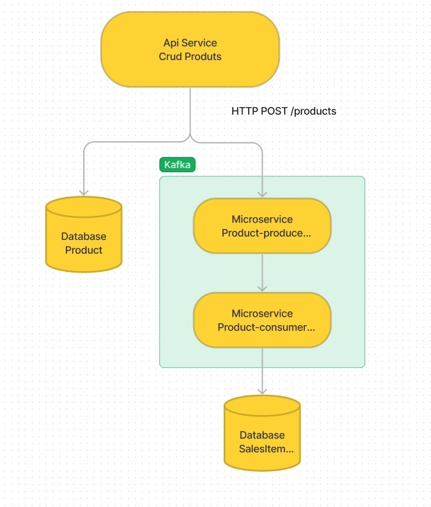

# *Projeto de Kafka e Microserviços vs Monolito*
Este é um projeto de demonstração que tem como objetivo apresentar a utilização de conceitos importantes no desenvolvimento de software, como SOLID, microserviços e o uso do Kafka como ferramenta de integração de sistemas. Este será um projeto que estará em desenvolvimento e como base para outros desenvolvedores que desejam aprender, o git clone está liberado. 

## **# Sobre o projeto ?**

Este projeto trata-se de um CRUD com o objetivo de manter sempre atualizadas as informações de dois bancos de dados distintos. A ideia é que, quando uma atualização for feita em um banco de dados, a outra base de dados de outro serviço também seja atualizada automaticamente, utilizando-se um serviço de mensageria.

Em outras palavras, o projeto busca garantir a consistência de dados entre diferentes sistemas, por meio da utilização de uma abordagem de mensageria. Com isso, as informações permanecem atualizadas em ambos os bancos de dados, evitando possíveis problemas de inconsistência de dados.

## **Arquitetura do Projeto**

## Como Instalar o Projeto ?

Para executar o projeto, é bem simples. :wink: 

 - Basta ter o **node** instalado, de preferencia a versão **v19.6.0**
 - Docker
 
 ### Docker: 
Para utilizar esta aplicação para que seja uma melhor experiência. utilize o docker para subir os serviços. 
- Site para a instalação do **docker**  https://docs.docker.com/compose/

Após realizar o download, execute dentro da pasta do projeto, onde tem o arquivo docker-compose.yml
> docker-compose up

### Instalando:

Ao baixar o Projeto, você encontrará 2 pastas, uma api service que é um monolito e uma pasta com dois microsserviço.

Primeiro entre no **monolito** chamado de **api-service**, 
> npm i
> npx prisma migrate dev

Logo em Seguida entre nos outros microsserviços, **Product-producer** e **Product-consumer**, 
Quando estiver no **Product-consumer**
>  npm i
>  npx prisma migrate dev

Agora entraremos no **Product-producer**
> npm i 

## Como Executar o projeto

Entre nos três servicos e execute:
> npm run start:dev

## Kafka para leigos

Kafka é uma plataforma de processamento de dados em tempo real que permite a troca de informações entre diferentes sistemas de forma escalável e confiável. Nesse contexto, um "produtor" (producer) é uma aplicação ou sistema que envia informações para o Kafka, enquanto um "consumidor" (consumer) é uma aplicação ou sistema que recebe essas informações.

Em termos simples, imagine que você está enviando uma mensagem de texto para um amigo. Nesse caso, você é o produtor da mensagem e seu amigo é o consumidor. Quando você envia a mensagem, ela é colocada em uma fila (ou tópico) no Kafka. O seu amigo, por sua vez, pode se inscrever nesse tópico e receber todas as mensagens que são enviadas para ele.

Essa é a essência do Kafka: permite que diferentes sistemas e aplicativos se comuniquem entre si de forma assíncrona e distribuída. O Kafka é capaz de lidar com grandes volumes de dados em tempo real, garantindo que as informações sejam processadas e entregues de forma confiável e eficiente.